# Polyglot Codebase Knowledge Graph

> Generated offline by **readmenator**. Supports C, C++, Python, Go, Rust, JS/TS, Java, C#, Shell, PHP, Dart, GDScript, Nim, ASM.
> No LLMs. No tokens. Pure static analysis.

**Total Files Parsed:** 1 | **Total Symbols Extracted:** 6 | **Total Imports:** 15

## Structural Knowledge Map

```mermaid
graph TD
    classDef mod fill:#1e1e1e,stroke:#ff6666,stroke-width:2px,color:#fff;
    classDef cls fill:#2d2d2d,stroke:#4ec9b0,stroke-width:2px,color:#fff;
    classDef fn fill:#333,stroke:#dcdcaa,stroke-width:1px,color:#dcdcaa;
    classDef ext fill:#111,stroke:#666,stroke-dasharray: 5 5,color:#aaa;
    main_py["main.py (py)"]
    class main_py mod;
    main_py_wheelEvent["wheelEvent"]
    class main_py_wheelEvent fn;
    main_py --> main_py_wheelEvent
    main_py_ToneGenerator["ToneGenerator"]
    class main_py_ToneGenerator cls;
    main_py --> main_py_ToneGenerator
    main_py___init__["__init__"]
    class main_py___init__ fn;
    main_py --> main_py___init__
    main_py_play_tone["play_tone"]
    class main_py_play_tone fn;
    main_py --> main_py_play_tone
    main_py_save_tone["save_tone"]
    class main_py_save_tone fn;
    main_py --> main_py_save_tone
    ext_sys["sys"]
    class ext_sys ext;
    main_py -.->|imports| ext_sys
    ext_math["math"]
    class ext_math ext;
    main_py -.->|imports| ext_math
    ext_numpy["numpy"]
    class ext_numpy ext;
    main_py -.->|imports| ext_numpy
    ext_pygame["pygame"]
    class ext_pygame ext;
    main_py -.->|imports| ext_pygame
    ext_time["time"]
    class ext_time ext;
    main_py -.->|imports| ext_time
    ext_pyaudio["pyaudio"]
    class ext_pyaudio ext;
    main_py -.->|imports| ext_pyaudio
    ext_wave["wave"]
    class ext_wave ext;
    main_py -.->|imports| ext_wave
    ext_soundfile["soundfile"]
    class ext_soundfile ext;
    main_py -.->|imports| ext_soundfile
    ext_matplotlib_pyplot["matplotlib.pyplot"]
    class ext_matplotlib_pyplot ext;
    main_py -.->|imports| ext_matplotlib_pyplot
    ext_scipy_fft["scipy.fft"]
    class ext_scipy_fft ext;
    main_py -.->|imports| ext_scipy_fft
    ext_PyQt5_QtWidgets["PyQt5.QtWidgets"]
    class ext_PyQt5_QtWidgets ext;
    main_py -.->|imports| ext_PyQt5_QtWidgets
    ext_PyQt5_QtGui["PyQt5.QtGui"]
    class ext_PyQt5_QtGui ext;
    main_py -.->|imports| ext_PyQt5_QtGui
    ext_PyQt5["PyQt5"]
    class ext_PyQt5 ext;
    main_py -.->|imports| ext_PyQt5
    ext_PyQt5_QtCore["PyQt5.QtCore"]
    class ext_PyQt5_QtCore ext;
    main_py -.->|imports| ext_PyQt5_QtCore
    ext_mpl_toolkits_mplot3d["mpl_toolkits.mplot3d"]
    class ext_mpl_toolkits_mplot3d ext;
    main_py -.->|imports| ext_mpl_toolkits_mplot3d
```

---

## Architecture Reference

### PY (1 files)

#### `main.py`
**Path:** `main.py`

**Classs:**
- `ToneGenerator` (line 25)

**Functions:**
- `wheelEvent` (line 17)
- `__init__` (line 26)
- `play_tone` (line 62)
- `save_tone` (line 98)
- `generate_waveform` (line 126)
